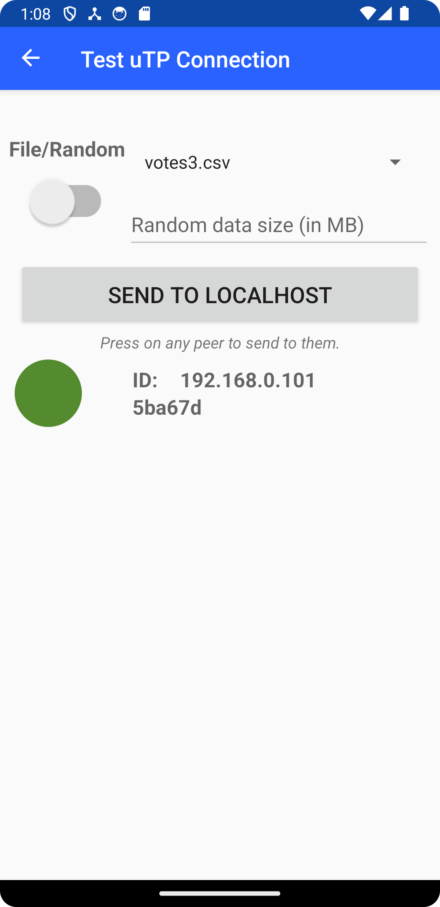

# Project Description
This project is built into the already existing TrustChain code, and is intended to eventually support democratic decision making on the TrustChain-Superapp. This is done by implementing peer-to-peer data transfers through uTP (Micro Transport Protocol), such that it is possible to monitor the status of each connection. 

## Overview and Usage
After installing the APK on your Android device or emulator, you can navigate to the debug section of the app. Here, by pressing on the menu button, it is possible to navigate to the "Test uTP Connection" section. This section allows for testing the uTP functionality of the app. As can be seen in the image below, the user interface consists of a button for sending test data to the local host. There is also a toggle switch for selecting between sending a file, or typing in a specified data size for sending random data corresponding to that size. The available files (votes3.csv" and "votes13.csv) are found in the dropdown menu. They contain test data from DAOs showing proof of concept of binary data transfer. 
A scrollable list of available peers is also present. By clicking on a peer, the data transferring process is initiated to that peer, rather than to the local host. The visual indicator of that particular peer will be changed accordingly to its current status (see below for exact specifications). The actions are also documented in a, per peer, connection log. When sending or receiving data, a message with the peer's IP address and port is displayed in the log, together with the size of the data being transferred. A 50MB maximum capacity for sent files has also been introduced, in order not to permit unreasonably large files.

    
Debug screen UI

     

Colour specifications:
- Default: Gray
- Sent heartbeat received within 30s: Green
- Sent heartbeat received between 30-60s ago: Yellow
- Sent heartbeat received between 60-120s ago: Orange
- Sent heartbeat received more than 120s ago: Red

## Implementation and Functionality
<!-- TODO: add explanation of how it works --> 

A high level overview of some basic functionalities from the perspective of the UtpTestFragment class is given below.
- Peer Discovery: The getPeers() function is used to discover peers. It uses the getUtpCommunity().getPeers() method to get a list of peers and adds them to the peers list.  
- Setting up the UI: The onViewCreated() function sets up the user interface. It populates the list of peers and sets up listeners for sending test data to peers when they are clicked. 
- Sending Data: The sendTestData() function is used to send data to a peer. It takes either peer as argument or sends data to localhost for quick connection testing. The data to be sent is read from a resource file and then sent to the peer using the UTP endpoint.  
- Receiving Data and Updating UI: The raw packet listeners are used to listen for incoming packets and update logs based on the information. When a packet is received, it checks if it's a SYN packet (indicating the start of a connection) or a packet with a window size of 0 (indicating the end of a connection). If it's a SYN packet, it starts a connection log. If it's a packet with a window size of 0, it finalizes the connection log. For all other packets, it updates the connection log.
- Connection Logs: Connection logs are used to keep track of the data transfer. The startConnectionLog(), updateConnectionLog(), and finalizeConnectionLog() functions are used to manage the connection logs. They update the UI to show the status of the data transfer.  
- Updating Peer Status: The updatePeerStatus() function is used to update the status of a peer in the UI. It finds the status indicator for the peer and changes its color based on the peer's status. New peers are not displayed unless one refreshes the page by leaving it and coming back. If it would have been otherwise, the visual status updates would have needed to follow a different system for colour specifications.  

Please refer to the source code for more detailed information about each method and how they are used within the class.

<!-- Don't know if this section is relevant or not... --> 
### Associated files
UtpTestFragment (`UtpTestFragment.kt`)
UtpTestFragment is a class in the nl.tudelft.trustchain.debug package. It is used for testing uTP functionality within the Superapp. The class provides a user interface for sending/receiving test data to peers and displays connection logs. It maintains a list of discovered peers and manages a UDP endpoint for uTP communication. It also keeps track of various connection-related information, such as the status of each connection and the data transferred. 

Layout XML (`fragment_utp_test.xml`)
This file defines the layout of the `UtpTestFragment` user interface. It includes elements such as a Spinner for selecting the DAO, an EditText for inputting the size of the random data, a Button for sending test data to localhost, and two ScrollViews for displaying the list of peers and connection logs.

Navigation XML (`nav_graph_debug.xml`)
This file defines the navigation graph for the debug feature of the application. It includes a navigation action from the `DebugFragment` to the `UtpTestFragment`, indicating that the `UtpTestFragment` can be navigated to from the `DebugFragment`.

(Also see ipv8/src/main/java/nl/tudelft/ipv8/messaging)

## Issues

There still exist some general issues that would have to be tackled. They include:
- Repeatedly (spam) sending can cause the IPv8 layer to crash.
    - We are not sure if that's the bug in our code or built-in protection against DDOS.
- Connection logs may break with some concurrent file sending attempts.
    - Every connection attempt (also denied) is logged as its own entry, as such it can spam the whole console.

In addition to that, there are some TODOs left in the code, which have not been addressed, such as in UtpTestFragment.kt. Where they are present there is a existing working solution or temporary workaround, but the TODO is still there hinting at how the problem can be solved more efficiently.